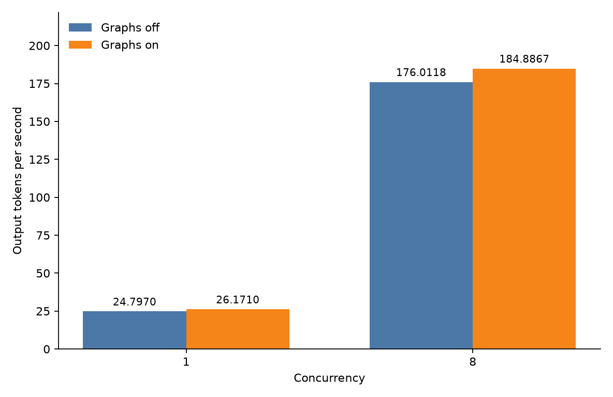
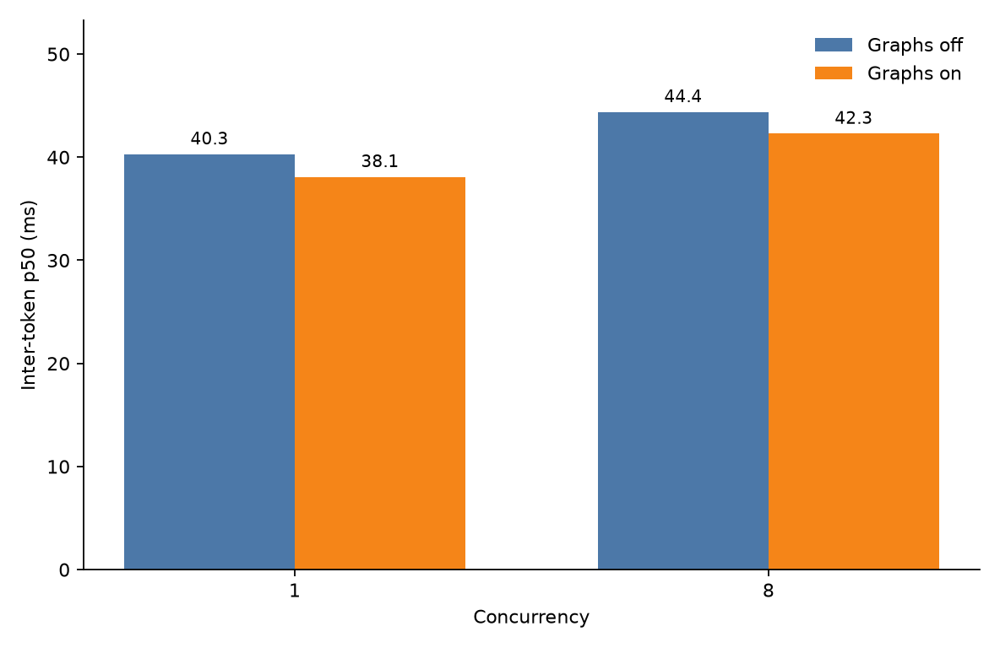

# Pylon

Pylon is a single-GPU inference server for [Qwen3-4B-Instruct-2507](https://huggingface.co/Qwen/Qwen3-4B-Instruct-2507). The weights stay fixed. It exposes an OpenAI-compatible `POST /v1/chat/completions` endpoint.

The additions on top of a normal serving loop are decode-first scheduling, CUDA-graph decode, a two-hit prefix cache, prompt n-gram verification, and skip-ahead admission.

On one NVIDIA L4, CUDA-graph decode beat this server's own eager path. Output speed went from 24.8 to 26.2 tokens/s at concurrency 1, and from 176.0 to 184.9 at concurrency 8. Speculation, the prefix cache, and admit-skip were off. Temperature was 0. This is not a comparison against another server.

## What it does

- Decode-first scheduling. Every step decodes the active batch, then prefills one 256-token chunk of a waiting prompt. If the batch is full and the oldest prompt has waited under 100 ms, prefill waits. Time to first token can rise.
- CUDA-graph decode. The decode step is captured and replayed. That is the gain in the numbers above.
- Paged KV and a two-hit prefix cache. KV lives in 256-token pages. A full page of prompt tokens is kept once the same block shows up again. `PYLON_PREFIX_CACHE=false` turns that off.
- Prompt n-gram speculation. This provides a verify path for speculated tokens. It was off in the published benchmark.
- Skip-ahead admission. Each request reserves its prompt and its full generation in pages. If the first waiter does not fit, a later one that does can start. `PYLON_ADMIT_SKIP` defaults to 4. A request that has waited 100 ms stays next.

<p>&nbsp;&nbsp;&nbsp;&nbsp;</p>

## Decode benchmark

| Concurrency | CUDA graphs | Output tokens/s | TTFT p50 (ms) | TTFT p99 (ms) | Inter-token p50 (ms) | Peak GPU memory |
| --- | --- | ---: | ---: | ---: | ---: | ---: |
| 1 | off | 24.8 | 51.1 | 51.8 | 40.3 | 19.77 GiB |
| 1 | on | 26.2 | 51.6 | 52.3 | 38.1 | 19.94 GiB |
| 8 | off | 176.0 | 237.7 | 695.5 | 44.4 | 19.77 GiB |
| 8 | on | 184.9 | 233.4 | 678.6 | 42.3 | 19.94 GiB |

CUDA-graph decode on `decode_heavy` raised output tokens per second from 24.7970 to 26.1710 at concurrency 1 and from 176.0118 to 184.8867 at concurrency 8, which is 5.54% and 5.04% over the eager rows in `benchmarks/results/20261003T153549Z-graph-decode-heavy.json`. Inter-token p50 fell from 0.04026 s to 0.03815 s and from 0.04441 s to 0.04226 s, while time to first token p50 went from 0.05110 s to 0.05159 s at concurrency 1 and from 0.23770 s to 0.23339 s at concurrency 8. Every row still computed 12288 prefill tokens, and peak GPU memory rose from 21225275392 bytes to 21407727616 bytes.

Benchmark setup: NVIDIA L4, Qwen/Qwen3-4B-Instruct-2507 snapshot `cdbee75f17c01a7cc42f958dc650907174af0554`, PyTorch 2.14.1+cu130, CUDA 13.0, driver 595.58.03, batch cap 8, prefill chunk 256, 32 requests, 3 repeats. `eager` means graphs off and `pylon` means graphs on.

## Requirements

- An NVIDIA GPU with CUDA. The server exits if CUDA is missing. An L4 (24 GB) is the reference card.
- Python 3.11 or newer, with PyTorch 2.13 or newer.

## Run

```bash
uv run pylon
```

The server listens on `127.0.0.1:8000`. `GET /health` is ready after the weights load and warmup finishes.

## Unit tests

To run the unit tests, including those that run without a GPU:

```bash
uv run python -m unittest discover -s tests
```

## Smoke check

```bash
uv run python benchmarks/run.py \
  --systems eager \
  --workload decode_heavy \
  --concurrency 1 \
  --limit 8 \
  --repeats 1 \
  --label eager-decode-heavy-c1
```

This runs against a server that is already up. It is not the published result.

## Reproduce

Reproduction requires an NVIDIA GPU with CUDA, Python 3.11+, and PyTorch 2.13+.

```bash
uv run python benchmarks/run.py \
  --systems eager,pylon \
  --workload decode_heavy \
  --concurrency 1,8 \
  --repeats 3 \
  --label graph-decode-heavy
```

`eager` means graphs off. `pylon` means graphs on. Both leave speculation, the prefix cache, and admit-skip off. This writes the table above. It does not compare against another server.

## License

Apache-2.0. See `LICENSE`.
